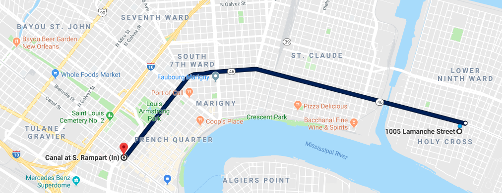

# Transportation!

## Buses and Streetcars
[New Orleans Regional Transit Authority](https://www.norta.com/) is our network of buses and streetcars that wind through every neighborhood of the Crescent City. From Uptown to Downtown, from Lakeview to the Lower Ninth, from Mid-City across the Mississippi River and to the parish lines, the RTA goes there.

Route _88_ picks up at St. Claude and Caffin (one block away) and can drop you off in the Heart of the Central Business District

Use the RTA App for maps of the different routes and thier pickup times
- [iOS](https://itunes.apple.com/us/app/rta-gomobile-2-0/id1250834677)
- [Android](https://play.google.com/store/apps/details?id=com.norta.gomobileapp)

## Blue Bikes
[Blue Bikes Nola](https://bluebikesnola.com/) is New Orleans' bike share program. For $0.10/Minute you can ride anywhere within the Blue Bike network. Currently, 1005 Lamanche is not within the network, but there is a Blue Bike rack about 1 mile away. Please see the Blue Bike website for signup and best practices to avoid additional charges.

## Ride Sharing
